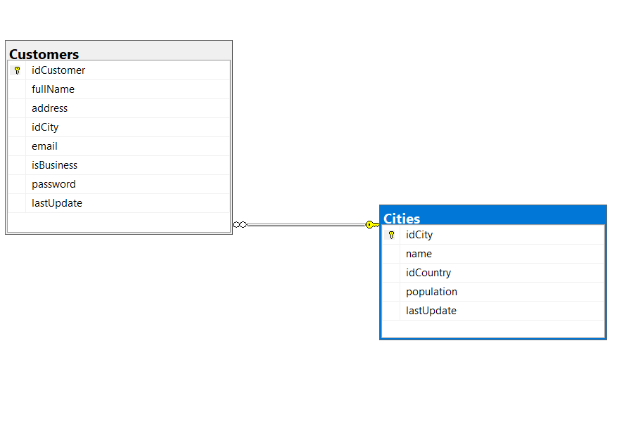

# julio3mvcef

# configuracion 

En la función **ConfigureServices**, agregar la siguiente línea.

```c#
    public void ConfigureServices(IServiceCollection services)
    {
        services.AddControllersWithViews(); // <-- usar MVC
    }
```

En la función Configure, indicar como se va a llamar el controlador

```c#
		// este es el enrutador.
		app.UseEndpoints(endpoints =>
        {
            endpoints.MapControllerRoute(
                name: "default",
                pattern: "{controller=Home}/{action=Index}/{id?}");
        });
```

## Agregar Entity Framework Core

Con Nuget (Package Manager Console)

```
Install-Package Microsoft.EntityFrameworkCore -Version 6.0.0-preview.5.21301.9
Install-Package Microsoft.EntityFrameworkCore.Relational -Version 6.0.0-preview.5.21301.9
Install-Package Microsoft.EntityFrameworkCore.SqlServer -Version 6.0.0-preview.5.21301.9
Install-Package Microsoft.EntityFrameworkCore.Tools -Version 6.0.0-preview.5.21301.9
```


## scaffold

>  Scaffold-DbContext "Data Source=PCJC\SQLDEV;Initial Catalog=MilkCo;Integrated Security=True" Microsoft.EntityFrameworkCore.SqlServer -OutputDir Models  -DataAnnotations -table customers,cities


## Base de datos



